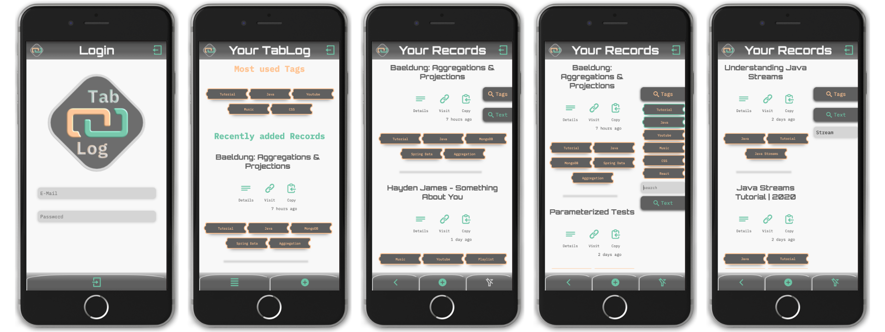
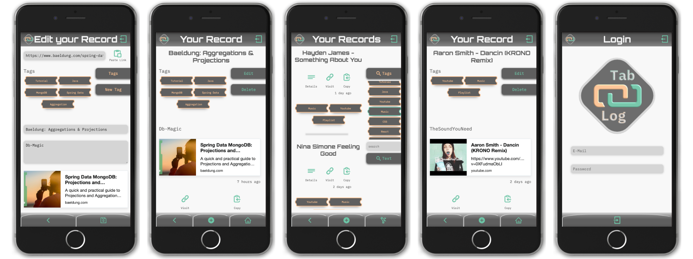

# TabLog

## Archiviere Links und habe Sie jeder Zeit griffbereit.

„Ach…wo hatte ich noch gleich diesen Link?“

Mit TabLog gehört diese Frage der Vergangenheit an. Speichere und kategorisiere deine Links um sie jeder Zeit wiederzufinden. "Dieses eine Backrezept“, der Lieblingsmix auf YouTube oder doch das Tutorial, das du dir unbedingt noch anschauen möchtest 
...mit der Full Stack WebApp "TabLog" führst du deine eigene Bibliothek.

### Demo

Eine Live Demo findest du unter https://www.tab-log.de.

LoginIcon: testuser@test.net | Password: Password123

### Tech Stack
Java 15 | Spring Boot | Spring Data | Spring Security | JWT | Maven | JUnit5 | Mockito | Lombock | MongoDB | Heroku | Docker | JavaScript | React | React-Router | Styled Components | prop-types

